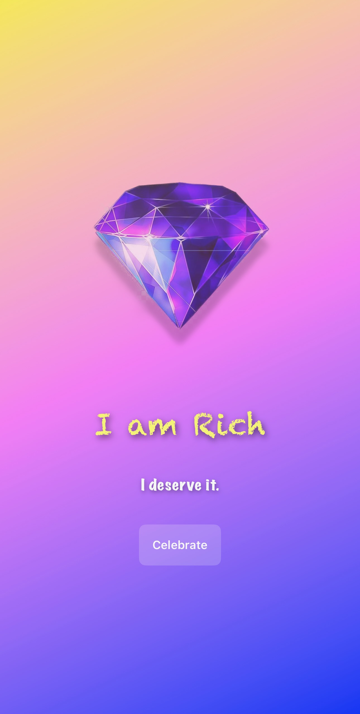

```markdown
# IAmRich

A playful SwiftUI version of the iconic “I am Rich” app. Displays a shiny diamond, rotating affirmations, and optional interactive effects.

This project demonstrates:
- **SwiftUI** for a clean, declarative UI
- **Animations** (short flash effect on the diamond, confetti, etc.)
- **MVVM architecture** for scalable code
- **Gradient backgrounds** (day mode vs. night mode)
- **Multiple short affirmations** that rotate over time
- **Optional sound** (coin sound upon tapping the diamond)

---

## Features

- **Diamond image** front and center, symbolizing abundance
- **Tapping the diamond**:
  - Brief flash animation
  - Cycles to the next affirmation
- **Night mode**: Long-press the diamond to toggle a darker gradient
- **Confetti**: A “Celebrate” button triggers colorful confetti falling from the top
- **Rotating affirmations**: Updated automatically every few seconds or on diamond tap

---

## Installation

1. **Clone** the repository:
   ```bash
   git clone https://github.com/brzezinskisebastian/IAmRich.git
   ```
2. **Open** the project in Xcode:
   - Double-click `I am Rich.xcodeproj` (or open via Xcode → File → Open).
3. **Optionally** add a coin sound:
   - Place `coins.mp3` (or any `.mp3`) in the main bundle if you want the diamond tap to play a sound.
4. **Run** the app on a simulator or real device (iOS 14+ recommended).

---

## Screenshots




---

## Roadmap / Possible Improvements

- **Additional animations** for the diamond (e.g., rotation, sparkle)
- **Localization** for affirmations (English, Polish, etc.)
- **Dynamic background** changes with time of day
- **Widgets** (WidgetKit) for a daily affirmation on the home screen

---

## License

This project is released under the [MIT License](LICENSE).  
Feel free to modify and distribute as you wish.

---

## Author

**Sebastian Brzeziński**  
- [GitHub Profile](https://github.com/brzezinskisebastian)  
- [LinkedIn](https://www.linkedin.com/in/sebastian-brzeziński-a9a142144/)
```
